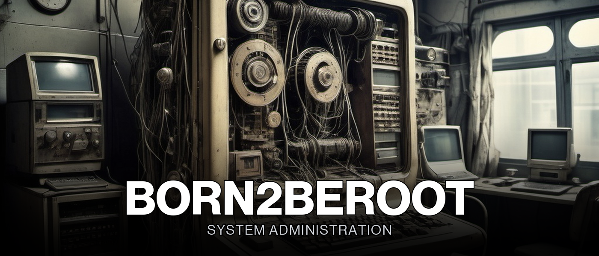

<div align="center">
  

  <p>
    <b>A hardened Debian server built from scratch inside a virtual machine, the first step into system administration.</b>
  </p>

  <p>
    <a href="https://42lausanne.ch"></a>
    
    
    
  </p>

  <p>
    
    
    
    
    
    
    
  </p>
</div>


<a name="overview"></a>
<h2 align="center">Overview</h2>

<div align="center">

No graphical interface, no shortcuts: `Born2beRoot` is about installing a Debian server
inside VirtualBox and configuring it entirely from the command line, under a strict set of
constraints. Encrypted LVM partitioning, a locked-down SSH service, a single open firewall
port, a real password and `sudo` policy, and a monitoring script that reports the machine's
health every ten minutes.

None of it is complex code. All of it has to be exact: one wrong firewall rule, one missed
password rule, and the whole defense fails.

**[Read the full subject](.assets/b2br.en.pdf)**

</div>


<a name="highlights"></a>
<h2 align="center">Highlights</h2>

This is the mandatory part only, no bonus: one functional, minimal server, nothing beyond what the subject asks for.

- **Debian, installed without a graphical interface.** No X.org, no desktop environment: a server has no use for one, and installing one is an instant zero at defense.
- **Two LVM partitions, both encrypted.** The disk is split with LVM so it can be resized later, and sits on top of an encrypted physical volume, exactly as the subject's `lsblk` example shows.
- **SSH hardened to a single non-standard port.** The service listens on port `4242` only, and logging in as `root` over SSH is disabled outright.
- **UFW leaves exactly one port open.** Every other port is closed by default; `4242` is the only exception, matching the SSH configuration.
- **A real password and `sudo` policy, not just a suggestion.** Expiration, minimum age, warning delay, character rules, attempt limits, and full input/output logging of every `sudo` call.
- **`monitoring.sh` broadcasts server health every 10 minutes.** Architecture, CPU and RAM load, disk usage, active connections, and `sudo` usage, pushed to every terminal via `wall` and driven by `cron`.


<a name="system-setup"></a>
<h2 align="center">System Setup</h2>

Built and evaluated entirely inside VirtualBox, no other hypervisor involved.

| Step | Choice |
|---|---|
| Hypervisor | VirtualBox |
| Operating system | Debian, latest stable release |
| Disk layout | Manual partitioning, LVM on top of an encrypted physical volume |
| Hostname | `<login>42` (must match the student's 42 login) |
| Users | `root`, plus a personal account in the `user42` and `sudo` groups |

To verify the setup from inside the VM once it's running:

```bash
# Confirm the OS and kernel
head -n 2 /etc/os-release

# Confirm SSH is listening only on 4242
ss -tunlp

# Confirm UFW is active with a single rule
sudo ufw status

# Confirm the LVM layout
lsblk
```


<a name="design-notes"></a>
<h2 align="center">Design Notes</h2>

The subject enforces a specific set of constraints, and the whole install is built around satisfying every one of them without exception.

> [!CAUTION]
> **No graphical interface, at all.** Installing X.org or any equivalent graphics server on a server whose only job is to run headless services is an automatic zero, regardless of everything else that works.

> [!IMPORTANT]
> **`root` cannot log in over SSH.** The service runs on port `4242` instead of the default `22`, and root login is explicitly disabled; access goes through the personal sudo-capable account instead.

> [!NOTE]
> **The password policy is exact, not approximate.** Passwords expire every 30 days, need at least 2 days between changes, warn the user 7 days before expiry, require 10+ characters with upper/lowercase and a digit, ban more than 3 repeated characters in a row, and can't contain the account's own username.

> [!WARNING]
> **`sudo` is restricted, logged, and rate-limited.** Three failed attempts trigger a custom error message, every `sudo` call (input and output) is archived under `/var/log/sudo/`, `TTY` mode is forced, and the usable `PATH` is locked down to a fixed list of directories.


<a name="partition-layout"></a>
<h2 align="center">Partition Layout</h2>

```text
sda                                     8G disk
├── sda1                              487M /boot
├── sda2                                1K
└── sda5                             7.5G part
    └── sda5_crypt                   7.5G LUKS-encrypted volume
        ├── <login>--vg-root         2.8G /
        ├── <login>--vg-swap_1       976M [SWAP]
        └── <login>--vg-home         3.8G /home
```

Mandatory scope only: two logical volumes on top of one encrypted physical volume, matching
the subject's reference `lsblk` output. The bonus layout (`/var`, `/srv`, `/tmp`, separate
`/var/log`, and the extra WordPress/service setup) was not attempted.


<a name="configuration-reference"></a>
<h2 align="center">Configuration Reference</h2>

<div align="center">

| Category | Parameters | Example |
| --- | :---: | --- |
| System access | 3 | `SSH: port 4242` |
| Password policy | 6 | `max age: 30 days` |
| Sudo policy | 4 | `max retries: 3` |
| Monitoring | 11 | `monitoring.sh` |

</div>

<table width="100%">
<tr><th width="26%">Parameter</th><th>Value</th></tr>
<tr><td colspan="2" align="right"></td></tr>
<tr><td align="center"><code>SSH port</code></td><td><code>4242</code>, the only port UFW leaves open</td></tr>
<tr><td align="center"><code>SSH root login</code></td><td>Disabled; access only through the personal sudo user</td></tr>
<tr><td align="center"><code>Firewall</code></td><td>UFW, active at boot, single allow rule on <code>4242</code></td></tr>

<tr><td colspan="2" align="right"></td></tr>
<tr><td align="center"><code>Max age</code></td><td>30 days before a forced change</td></tr>
<tr><td align="center"><code>Min age</code></td><td>2 days minimum between two changes</td></tr>
<tr><td align="center"><code>Warning delay</code></td><td>7 days before expiry</td></tr>
<tr><td align="center"><code>Length &amp; content</code></td><td>10+ characters, upper &amp; lowercase, at least one digit</td></tr>
<tr><td align="center"><code>Repeated characters</code></td><td>No more than 3 identical characters in a row</td></tr>
<tr><td align="center"><code>Username reuse</code></td><td>The password can't contain the account's username</td></tr>

<tr><td colspan="2" align="right"></td></tr>
<tr><td align="center"><code>Max retries</code></td><td>3 attempts before <code>sudo</code> locks out</td></tr>
<tr><td align="center"><code>Error message</code></td><td>Custom message on a wrong password</td></tr>
<tr><td align="center"><code>Logging</code></td><td>Every input and output archived in <code>/var/log/sudo/</code></td></tr>
<tr><td align="center"><code>Restricted PATH</code></td><td>Locked to a fixed list of trusted directories</td></tr>

<tr><td colspan="2" align="right"></td></tr>
<tr><td align="center"><code>Schedule</code></td><td>Broadcast to every terminal every 10 minutes via <code>cron</code> + <code>wall</code></td></tr>
<tr><td align="center"><code>Architecture</code></td><td>OS architecture and kernel version</td></tr>
<tr><td align="center"><code>CPU</code></td><td>Physical and virtual processor counts, current load</td></tr>
<tr><td align="center"><code>Memory</code></td><td>Available RAM and usage percentage</td></tr>
<tr><td align="center"><code>Storage</code></td><td>Available disk space and usage percentage</td></tr>
<tr><td align="center"><code>Uptime</code></td><td>Date and time of the last reboot</td></tr>
<tr><td align="center"><code>LVM status</code></td><td>Whether LVM is active</td></tr>
<tr><td align="center"><code>Connections</code></td><td>Number of active TCP connections</td></tr>
<tr><td align="center"><code>Users</code></td><td>Number of users currently logged in</td></tr>
<tr><td align="center"><code>Network</code></td><td>IPv4 address and MAC address</td></tr>
<tr><td align="center"><code>Sudo usage</code></td><td>Number of commands executed with <code>sudo</code></td></tr>
</table>


<a name="skills-developed"></a>
<h2 align="center">Skills Developed</h2>

<table width="100%">
<tr><th>Learning Outcome</th><th width="28%">Piscine Skill Area</th></tr>
<tr><td>Installing and hardening a headless Linux server</td><td align="center">Network & System Administration</td></tr>
<tr><td>Disk encryption and LVM partitioning</td><td align="center">Security</td></tr>
<tr><td>Firewall, SSH, and access control configuration</td><td align="center">Security</td></tr>
<tr><td>Writing a monitoring script driven by cron</td><td align="center">Shell</td></tr>
</table>


<a name="result"></a>
<h2 align="center">Result</h2>

<div align="center">
  
  <br/>
  <sup><i>Validated on November 9, 2024</i></sup>
</div>


<div align="center">

<sub>42 Lausanne · Common Core</sub>

</div>
